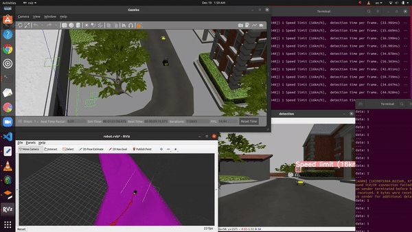
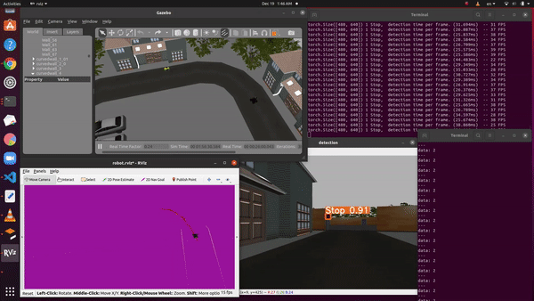
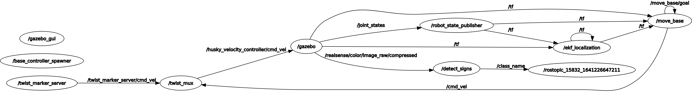

# Self driving car

This project is for detection module that have integrated with other modules in ROS

## Requirements
```bash
pip install -r requirements.txt;
```

### Usage

<!-- Make sure there is data existed(video/image) first in src/yolo_bot/data folder. -->

Makue sure the weights existed in src/yolo_bot/runs/weights data folder.


# commands to run the simulation for the robot

```bash
roslaunch darknet_ros world.launch;
```

```bash
roslaunch darknet_ros robot.launch;
```

```bash
roslaunch husky_viz view_robot.launch;
```

```bash
roslaunch husky_navigation move_base_mapless_demo.launch;
```

```bash
rostopic echo /class_name;
```

```bash
./detect_streams_signs;
```







<!--  -->


The project publish signs_names to planner_node and subscribe from Gazebo

That is my account [Github](https://github.com/WikiGenius)

That is my Website [WikiGenius](https://muhammedelyamani.blogspot.com/)


